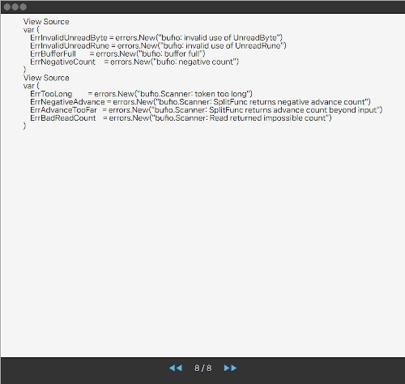
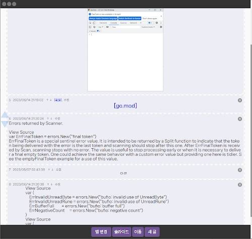

# SlideViewer
이미지, 텍스트 파일, html 파일을 슬라이드 웹으로 보여줌
---------------------
실행파일 경로의 slide 폴더 안에 있는 파일을 슬라이드로 보여준다.

https://github.com/nosoogja/SlideViewer/releases/download/0.1/SlideViewer.exe
-----------------------
## Slide

## Board

## Chat

